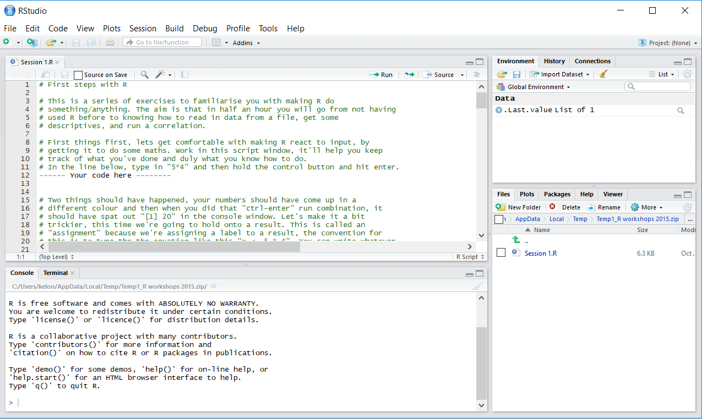

```{r setup, include=FALSE}
options(htmltools.dir.version = FALSE)
```

background-image: url("images/Pardalot_Risdon_Brook.jpg")
background-size: 90%

???

Image credit: [JJ Harrison](https://commons.wikimedia.org/wiki/File:Pardalotus_striatus_-_Risdon_Brook.jpg)

---
class: center, middle

##Promoting the Adoption of R for Data Analysis Leveraging Obscure Trickery Et cetera

---
class: inverse, center, middle

# It was 2015...

### R 3.2.1 (World Famous Astronaut)


???

I was in my PhD and had R lumped on me by a supervisor who knew only a touch more than I did.

Past experiences had been bad, but this time it stuck. I became a radical.

---
class: center, middle


???

It suddenly became clear why I had to use R, and why everyone else should too:


---
class: center, middle

### No more collecting statistical software. 
--


### New tools faster than I could realise I wanted them.

---
class: center, middle

### It FORCED me to think about data differently
--

### What did my colleagues think?

---
class: center, middle


---
class: center, middle
# How do you convert dedicated SPSS users to R?

</br>

## This is a psychological problem 

#### Functionally analogous to increasing vaccination, improving diet, etc.

???
Ultimately, conversion to R is a psychological problem, and standard approaches to these problems can be applied.

What incentive is there to learn when you can already do your analyses another way?
The impacts of things like "Feeling the future" hadn't flowed through yet and we're STILL pushing hard on openness
Initial workshops traded on goodwill

---
class: center, middle
# How do you convert dedicated SPSS users to R?

--

### Incite motivation


--

### Remove barriers to initiation

--

### Facilitate persistence

---
class: center, middle
# Barriers to initiation

### Time cost

--

### Financial costs

--

### Low self-efficacy

--

 
???

I needed to address the concerns I had, that I'd lose a day and get nothing for it

---
class: center, middle
# Making it stick


### Needed to cover most use cases. 

--

### Needs to seem applicable
--

### Needed to be easy to integrate into workflow

???
Ultimately, it's no good if the next day people go back to what they were doing.

---
class: invert, center, middle
# R workshop for psych 0.0.0.9000

### 3 x 1 hour weekly workshops
### Minimal didactic content
### Observe and repeat analysis tasks
### Direct duplication of undergrad toolkit (plus graphs)
 
---
class: center, middle 



---
class: center, middle

## OUTCOMES

--

## Inconsistent engagement / attendance
--

## Discovery of uni device challenges
--

## Minimal transfer to practice

---
class: center, middle, inverse 

 
---
class: center
# R workshop for psych 0.0.1.0000

### 1 x 3 hour workshop
### Same content and general structure
### Special sauce
 
---
class: center, middle

# Different outcomes?
</br></br></br>

### Workshops run 2-3 times a year, reliably book out

### R is becoming a normal sight 

---
class: center, middle

# What's happening now?
</br>
## ~45 R users in psych now, up from about 5

## The workshop attracts other schools / faculties 

--

## Infectious adoption

---
class: center, middle

# What's happening now?

### Adoption of novel analyses / Applications

 Text-analysis
 
 Interactive data in teaching (Shiny)
 
 Better graphics
 
 Fully reproducible reports
 
 Previously impossible* analyses

---
class: center, middle

# What are we learning?
--

## Motivators for adoption are diverse
--

### HDR students are a soft target
--

### Undergrads are amenable.

---
class: center, middle

# What are the challenges?
</br></br>
## Management doesn't want the change

## Change comes to ECRs by choice, MCRs by force.  

---
class: center

## New Strategies for the Masses
#### a.k.a. More ducks, more often
</br>
### Normalisation of open practices
 

 
---
class: center, middle

## New Strategies for Management 
</br></br>
--

### Promises of employability
--

### Threaten SETUs

---
class: center, middle

# Social/Health psych perspective
</br>
### Norms are influential on willingness to engage
</br>
--

### Adoption is a function of risks / rewards


 